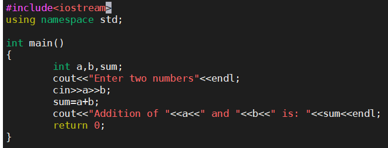
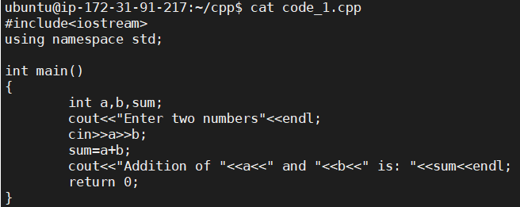
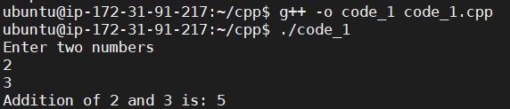

# How To Execute c++ program on linux
Note : My directory is cpp and file name is code_1.cpp. Commands are written according to this.

Step 1: Create a directory

	mkdir cpp
Step 2: Create a file using vi

	vi code_1.cpp
Step 3: Exit from current mode

	esc
Step 4: Write your code and save

	:w
 
Security group

Step 5: To come out of write mode

	esc
	:q
Step 6: You can also check your file content using following command

	cat code_1.cpp
 
Security group

Step 7: Compile and create executable file

	g++ -o code_1 code_1.cpp
Step 8: Run the code

	./code_1.cpp
You will get output like this -
## Output:
 
